# AI Sentiment Analysis Pipeline

> A local, GPU-accelerated LLM pipeline that classifies sentiment across HuggingFace datasets and generates structured analytical reports — no API keys, no data leaving your machine.

[](https://www.python.org/)
[](https://pytorch.org/)
[](https://huggingface.co/docs/transformers)
[](https://streamlit.io/)
[](https://github.com/TimDettmers/bitsandbytes)
[](https://huggingface.co/Qwen/Qwen2.5-3B-Instruct)

---

## What Is This?

Most sentiment analysis tools fall into one of two categories: lightweight bag-of-words classifiers that struggle with nuance, or cloud API calls that hand your data to a third party and charge per request.

This pipeline takes a different approach. It runs a **quantized causal language model entirely on your local GPU**, streams a HuggingFace dataset through it row by row, and produces a complete analytical report — sentiment distribution, polarity score, keyword frequency by class, and a confusion matrix when ground-truth labels exist.

The default configuration uses `Qwen/Qwen2.5-3B-Instruct` with **4-bit NF4 quantization**, keeping the full model within approximately 2 GB of VRAM while maintaining strong zero-shot classification performance. A Streamlit interface wraps everything into a browser-based workflow — no terminal required after launch.

| File | Responsibility |
|---|---|
| `app.py` | Streamlit UI — 6-page interactive interface |
| `sentiment_pipeline.py` | `SentimentPipeline` — inference orchestration and report generation |
| `model_manager.py` | `ModelManager` — HF auth, tokenizer, and 4-bit quantized model loading |
| `dataset_loader.py` | `DatasetLoader` — HF dataset loading and column selection |
| `hardware_preparation.py` | GPU detection and PyTorch device configuration |

---

## Screenshots

### System Status — GPU check

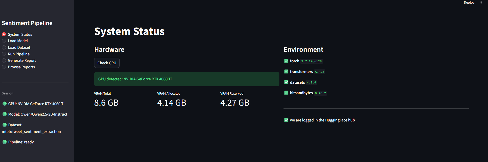

The **System Status** page reports GPU name, total VRAM, and currently allocated memory. It also lists installed package versions and confirms whether `HF_TOKEN` is present in the environment.

---

### Load Model

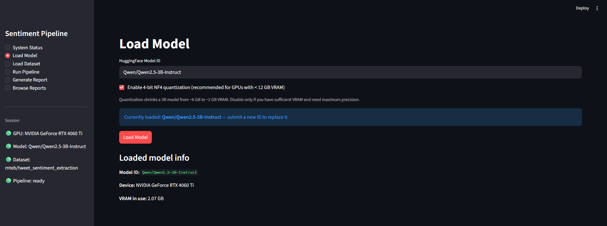

Enter any HuggingFace causal LM ID or leave the default (`Qwen/Qwen2.5-3B-Instruct`). Toggle 4-bit quantization based on available VRAM and click **Load Model**.

---

### Load Dataset

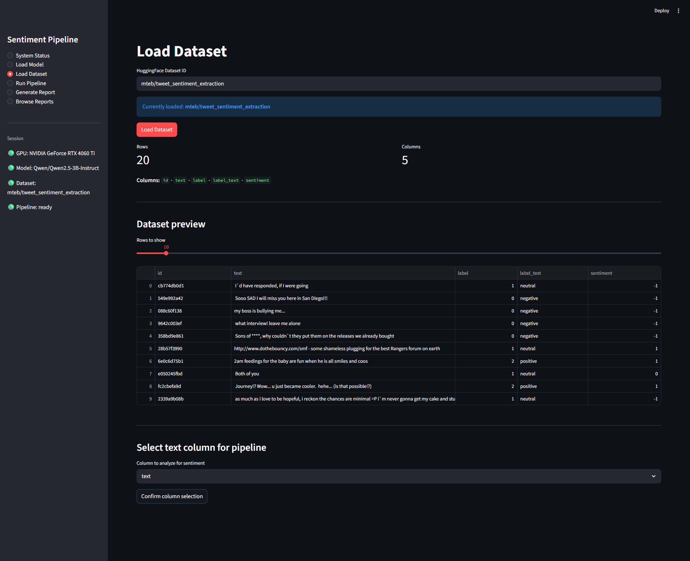

Enter any HuggingFace dataset ID. After loading, the page shows row count, column names, and a configurable preview. Select the text column to classify and confirm.

---

### Run Sentiment Pipeline

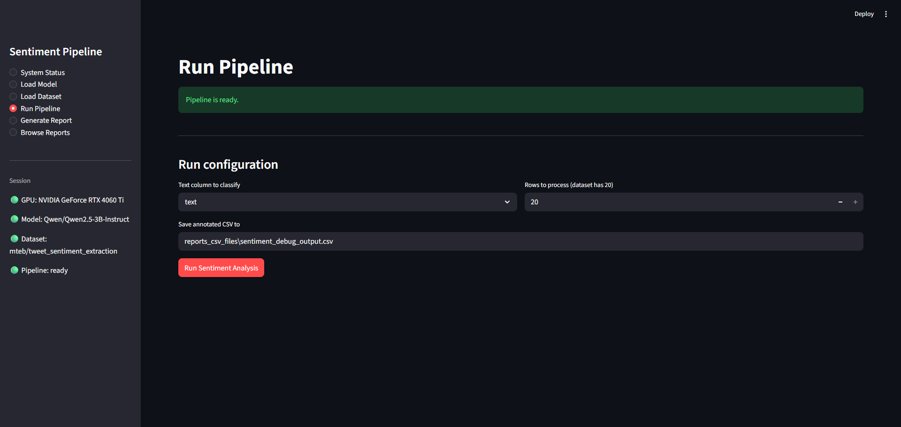

Click **Run Sentiment Analysis**. A live progress bar tracks row-level inference. On completion, the page displays a count breakdown across positive, neutral, and negative classes alongside a 30-row sample.

---

### Generate Report

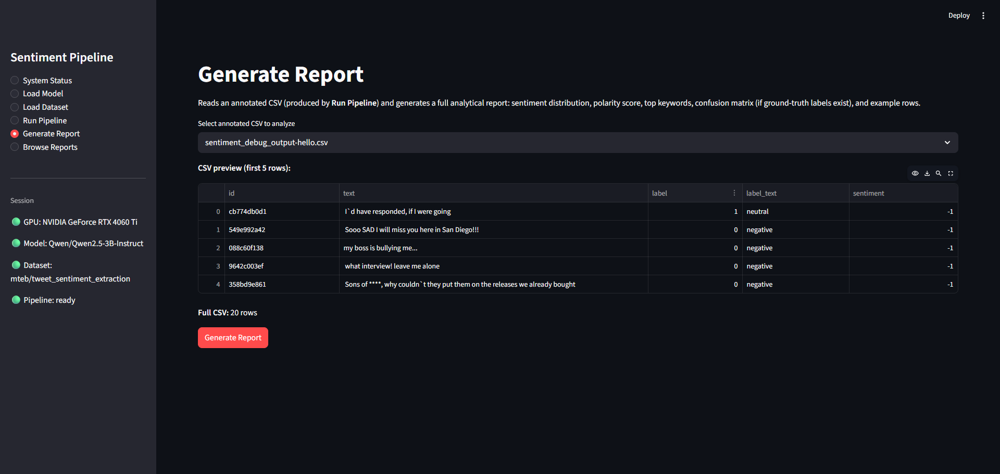

Point the input at the annotated CSV and click **Generate Report**. The full report renders inline and is simultaneously saved to a timestamped directory under `reports/`.

---

### Browse Reports — Summary & Charts

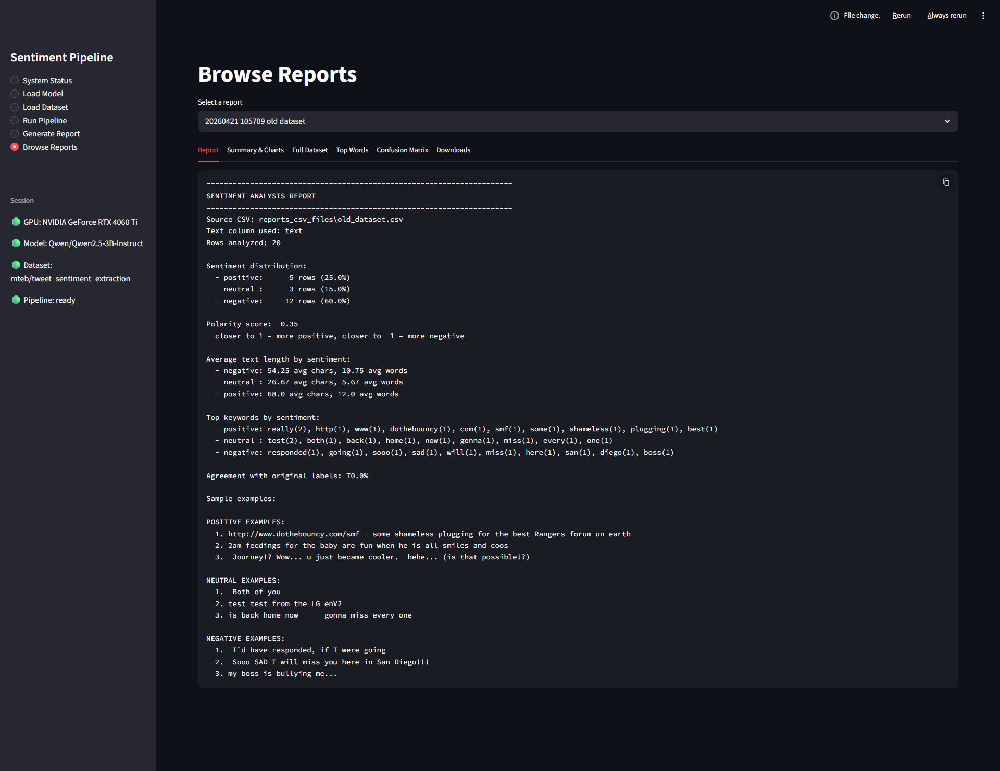

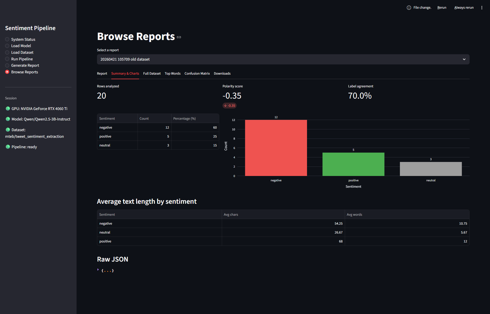

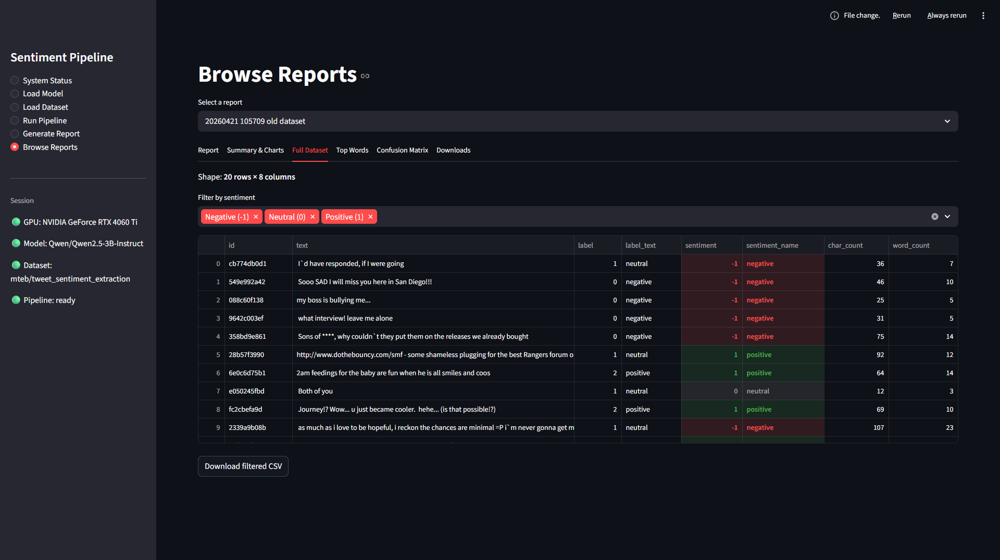

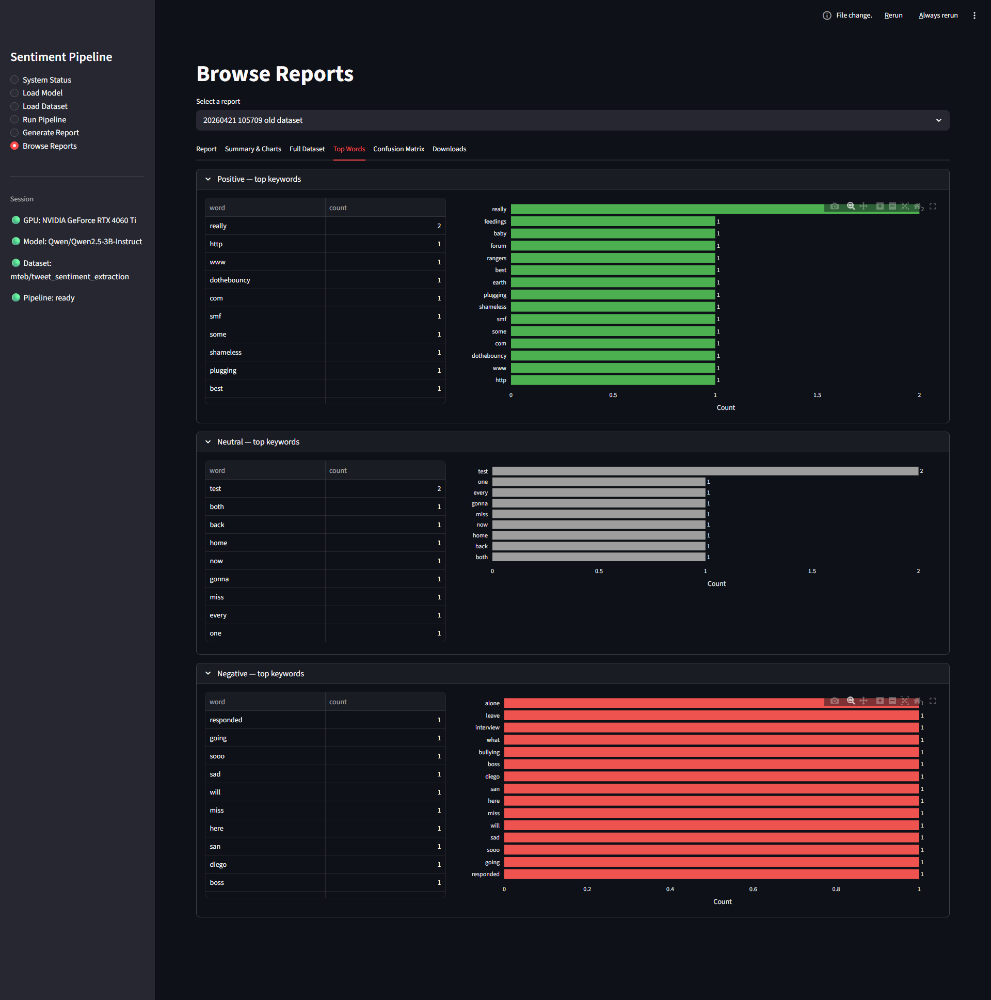

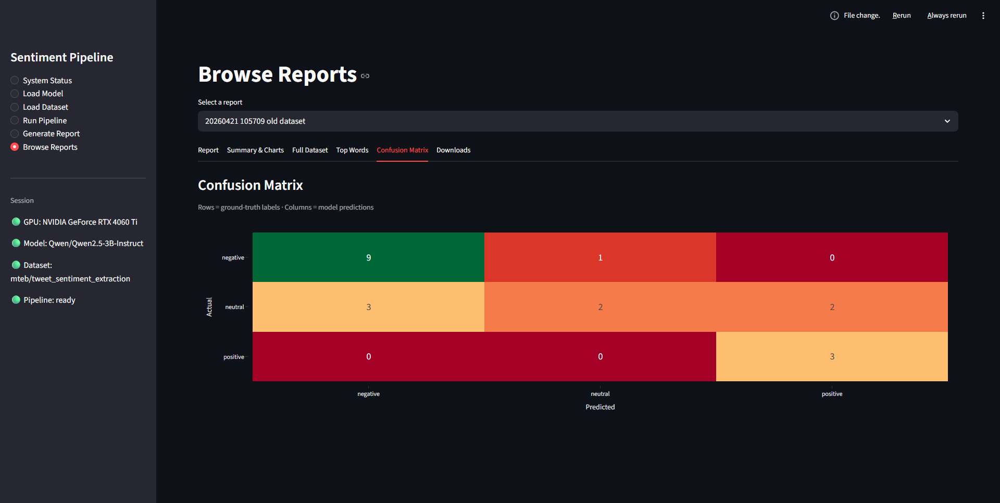

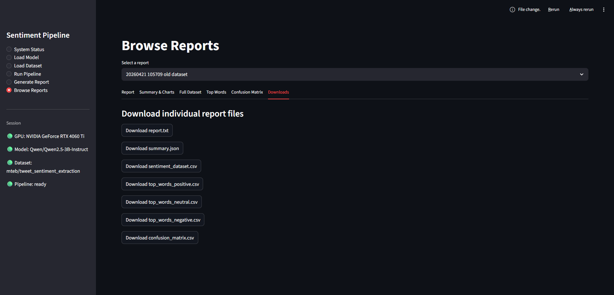

Six tabs expose the full artifact set for any past run: full report text, metrics and charts, filterable dataset, per-class keyword tables, confusion matrix, and one-click downloads.

---

## Feature List

### Inference
- Zero-shot sentiment classification using a locally running causal LLM — no API key required
- `max_new_tokens=6` forcing: model produces only a sentiment token (`1`, `0`, `-1`), eliminating long-completion latency
- Two-stage output parser: exact string match first, then regex fallback for edge cases (`": -1"`, `"label=1"`)
- Configurable retry logic — up to `max_retries` attempts before returning `None` on unresolvable outputs
- Supports any HuggingFace instruction-tuned causal LM (Qwen, Mistral, LLaMA, Phi, etc.)

### Quantization
- 4-bit NF4 quantization via BitsAndBytes — reduces a 3B model from ~6 GB to ~2 GB VRAM
- Double quantization and float16 compute dtype enabled by default
- Quantization toggle exposed in the UI — disable for GPUs with sufficient VRAM

### Dataset Handling
- Dataset-agnostic `DatasetLoader` — accepts any public HuggingFace dataset ID
- Arrow-backed in-memory storage via HuggingFace `Datasets`
- Interactive column selection: user picks the text column; no hardcoded schema
- Row count, column names, and preview displayed before committing to inference

### Report Generation
- **Sentiment distribution** — counts and percentages per class
- **Polarity score** — mean sentiment value across the full dataset
- **Average text length** — character and word count per class
- **Top-15 keywords per class** — word frequency with stopwords filtered
- **Sample examples** — representative rows per class
- **Confusion matrix** — actual vs. predicted agreement when a `label` column exists (`{0,1,2}` or `{-1,0,1}` supported)
- All artifacts saved to a timestamped directory under `reports/` — every run is self-contained

### Streamlit UI
- 6-page sidebar navigation with logical step ordering
- Live progress bar during inference
- In-page report rendering with download buttons
- Filterable, downloadable annotated CSV viewer
- Per-class keyword bar charts and sentiment distribution charts
- Session-state persistence — loaded model and dataset survive page navigation

### Hardware & Deployment
- GPU detection via `torch.cuda.is_available()` with immediate error on no-GPU rather than silent CPU fallback
- `device_map="auto"` pipeline initialization for multi-GPU or mixed-device setups
- Headless CLI mode — `sentiment_pipeline.py` can be driven directly without the UI

---

## How It Works

1. **Hardware check.** On startup, `hardware_preparation.py` calls `torch.cuda.is_available()`, sets PyTorch's default device to CUDA, and returns a boolean gate. If no GPU is found, `ModelManager` raises immediately with a descriptive error.

2. **Model loading.** `ModelManager` authenticates with HuggingFace using `HF_TOKEN` from the environment, then loads the tokenizer and causal LLM via `AutoTokenizer` and `AutoModelForCausalLM`. When quantization is enabled, it attaches a `BitsAndBytesConfig` for NF4 4-bit quantization with double quantization and float16 compute.

3. **Dataset loading.** `DatasetLoader` calls `load_dataset()` and stores the result as an Arrow-backed HuggingFace `Dataset`. The user selects which column contains the text to classify.

4. **Pipeline initialization.** `SentimentPipeline` wraps the model and tokenizer into a HuggingFace `text-generation` pipeline with `device_map="auto"`. It also removes the default `max_length` cap from the model's generation config to avoid a conflict with `max_new_tokens` at inference time.

5. **Inference.** For each row, `running_pipeline_on_a_record()` constructs a zero-shot classification prompt instructing the model to reply with exactly `1`, `0`, or `-1`. Generation is capped at 6 new tokens. The output is parsed in two stages: exact string match first, then a regex fallback. If both fail, the method retries up to `max_retries` times before returning `None`.

6. **CSV export.** After all rows are processed, the annotated dataset is saved to `sentiment_debug_output.csv` with the original columns plus a `sentiment` column.

7. **Report generation.** `generating_report()` reads the CSV and computes all metrics, writing every artifact to a timestamped subdirectory under `reports/`.

---

## Architecture

```
┌─────────────────────────────────────────────────────────┐
│                      app.py — Streamlit UI               │
│                                                          │
│  [System Status]  [Load Model]  [Load Dataset]          │
│  [Run Pipeline]   [Generate Report]  [Browse Reports]   │
│                         │                                │
└─────────────────────────┼────────────────────────────────┘
                          │
           ┌──────────────┼──────────────┐
           ▼              ▼              ▼
   ┌──────────────┐ ┌──────────────┐ ┌─────────────────────┐
   │ ModelManager │ │DatasetLoader │ │  hardware_           │
   │              │ │              │ │  preparation.py      │
   │ HF auth      │ │ load_dataset │ │                      │
   │ tokenizer    │ │ column pick  │ │  torch.cuda check    │
   │ 4-bit model  │ │ Arrow cache  │ │  device config       │
   └──────┬───────┘ └──────┬───────┘ └──────────┬──────────┘
          │                │                     │
          └────────────────┼─────────────────────┘
                           ▼
              ┌─────────────────────────┐
              │    SentimentPipeline    │
              │                         │
              │  text-gen pipeline      │
              │  row-level inference    │
              │  two-stage parser       │
              │  retry logic            │
              └────────────┬────────────┘
                           │
               ┌───────────┴───────────┐
               ▼                       ▼
   sentiment_debug_output.csv      reports/
   (annotated dataset)             sentiment_report_<timestamp>/
                                   ├── report.txt
                                   ├── summary.json
                                   ├── sentiment_dataset.csv
                                   ├── top_words_positive.csv
                                   ├── top_words_neutral.csv
                                   ├── top_words_negative.csv
                                   └── confusion_matrix.csv
```

The system is composed of four independently testable modules wired together by `SentimentPipeline`. Neither `ModelManager` nor `DatasetLoader` knows about each other — only the pipeline orchestrator does.

---

## Project Structure

```
AI_sentiment_analysis_pipeline/
│
├── app.py                          # Streamlit UI — 6-page interactive interface
├── sentiment_pipeline.py           # SentimentPipeline — inference + report orchestration
├── model_manager.py                # ModelManager — tokenizer + quantized model loading
├── dataset_loader.py               # DatasetLoader — HF dataset loading + column selection
├── hardware_preparation.py         # GPU detection + PyTorch device configuration
│
├── .env                            # HF_TOKEN (not committed)
├── .gitignore
│
├── sentiment_debug_output.csv      # Raw annotated dataset from last pipeline run
│
├── application_screenshots/        # UI screenshots for documentation
│
└── reports/
    └── sentiment_report_<timestamp>/
        ├── report.txt              # Human-readable full report
        ├── summary.json            # Machine-readable metrics and statistics
        ├── sentiment_dataset.csv   # Enriched dataset with sentiment labels and text lengths
        ├── top_words_positive.csv  # Top 15 keywords for positive class
        ├── top_words_neutral.csv   # Top 15 keywords for neutral class
        ├── top_words_negative.csv  # Top 15 keywords for negative class
        └── confusion_matrix.csv   # Actual vs. predicted (generated when labels exist)
```

---

## Getting Started

### Prerequisites

| Requirement | Notes |
|---|---|
| Python 3.10+ | Tested on 3.11 |
| CUDA-compatible GPU | ~6 GB VRAM unquantized; ~2 GB with 4-bit quantization |
| CUDA toolkit | Match your PyTorch build |
| HuggingFace account | Required for gated models; free at huggingface.co |

### 1 — Clone the repository

```bash
git clone https://github.com/Mohamad-Hachem/AI_sentiment_analysis_pipeline.git
cd AI_sentiment_analysis_pipeline
```

### 2 — Create and activate a virtual environment

```bash
python -m venv .venv

# Windows
.venv\Scripts\activate

# macOS / Linux
source .venv/bin/activate
```

### 3 — Install PyTorch with CUDA support

Install the build that matches your CUDA version. For CUDA 12.8:

```bash
pip install torch torchvision torchaudio --index-url https://download.pytorch.org/whl/cu128
```

Check the [PyTorch installation selector](https://pytorch.org/get-started/locally/) for other CUDA versions.

### 4 — Install project dependencies

```bash
pip install -r requirements.txt
```

### 5 — Configure environment variables

Create a `.env` file in the project root:

```env
HF_TOKEN=hf_your_token_here
```

Generate a token at `huggingface.co → Settings → Access Tokens`. Read-only scope is sufficient.

> **Note:** The `.env` file is listed in `.gitignore` and will not be committed. `ModelManager` reads `HF_TOKEN` via `os.environ.get()` at runtime.

### 6 — Load environment and launch

```bash
# Windows PowerShell
Get-Content .env | ForEach-Object { $k, $v = $_ -split '=', 2; [System.Environment]::SetEnvironmentVariable($k, $v) }

# macOS / Linux
export $(cat .env | xargs)

# Launch the Streamlit app
streamlit run app.py
```

> **First run:** Model weights are downloaded from HuggingFace Hub on first load and cached locally. For `Qwen/Qwen2.5-3B-Instruct` this is approximately 2–3 GB.

---

## Usage

The Streamlit interface guides you through the pipeline in a fixed logical order. Use the sidebar to navigate between pages.

**Step 1 — System Status**

Click **Check GPU** to confirm your GPU is available and VRAM headroom is sufficient.

**Step 2 — Load Model**

Enter a HuggingFace model ID or leave the default (`Qwen/Qwen2.5-3B-Instruct`). Toggle 4-bit quantization, then click **Load Model**.

**Step 3 — Load Dataset**

Enter any HuggingFace dataset ID (default: `mteb/tweet_sentiment_extraction`). Select the text column and confirm.

**Step 4 — Run Pipeline**

Click **Initialize Pipeline**, configure row count and output path, then click **Run Sentiment Analysis**. A live progress bar tracks inference.

**Step 5 — Generate Report**

Point the input at the annotated CSV and click **Generate Report**. The report renders inline and saves to `reports/`.

**Step 6 — Browse Reports**

Select any past run from the dropdown to explore its full artifact set across six tabs.

### Running headless (no UI)

```bash
python sentiment_pipeline.py
```

Edit the `if __name__ == "__main__":` block in `sentiment_pipeline.py` to configure the run programmatically.

---

## Key Design Decisions

| Choice | Reason |
|---|---|
| Local LLM inference, not an API | No per-call cost, no data transmitted externally, full control over generation parameters |
| 4-bit NF4 quantization via BitsAndBytes | Brings a 3B instruction model within reach of consumer GPUs (~6 GB → ~2 GB VRAM) with minimal accuracy degradation |
| `max_new_tokens=6` | Forces the model to produce only a sentiment token — eliminates most inference latency from long completions |
| Two-stage parser with retry | Models occasionally mis-format output; regex fallback after exact matching prevents silent failures |
| Dataset-agnostic `DatasetLoader` | Accepts any HuggingFace dataset ID with interactive column selection — no hardcoded schema |
| Modular class design | `hardware_preparation`, `ModelManager`, `DatasetLoader`, and `SentimentPipeline` each have a single responsibility with no circular dependencies |
| Timestamped report directories | Every run produces a self-contained artifact set under `reports/sentiment_report_<timestamp>/` |
| Streamlit front-end | Browser interface without removing the option to drive the pipeline programmatically |

---

## Tech Stack

| Layer | Library / Tool | Role |
|---|---|---|
| GPU compute | PyTorch + CUDA | Tensor operations, device management, memory allocation |
| LLM inference | HuggingFace Transformers | Model loading, tokenization, `text-generation` pipeline |
| Quantization | BitsAndBytes | 4-bit NF4 quantization with double quantization and float16 compute |
| Dataset | HuggingFace Datasets | Arrow-backed dataset loading, `.map()`, `.select()`, `.to_pandas()` |
| Data analytics | Pandas | CSV I/O, groupby aggregations, word frequency counting |
| UI | Streamlit | Browser-based interactive interface with session state |
| Model auth | huggingface_hub | Token-based authentication for gated models |
| Runtime | Python 3.11 | |

---

## Limitations

- **GPU required** — the pipeline raises immediately if no CUDA device is found; CPU fallback is intentionally disabled to avoid silent multi-hour runs on consumer hardware.
- **Row-level inference** — batch size is 1; throughput is limited by single-row forward passes. Large datasets (>10k rows) will take significant time.
- **Discrete output space** — the prompt constrains the model to `1`, `0`, `-1`. Outputs that don't conform after retries are recorded as `None` and excluded from the report.
- **English-primary** — the default model is instruction-tuned primarily on English data. Non-English datasets will work better with a multilingual model (e.g., `Qwen2.5-7B-Instruct`).
- **Cold start** — first run downloads model weights from HuggingFace Hub (~2–3 GB for the default model); subsequent runs use the local cache.
- **Single model at a time** — the pipeline holds one model in VRAM; running multiple models in parallel requires separate processes.

---

## Future Improvements

- **Batch inference** — replace the row-level loop with batched `pipeline()` calls to increase throughput on larger datasets.
- **Streaming dataset support** — replace `load_dataset(split="train")` with `load_dataset(..., streaming=True)` to handle datasets too large to fit in memory.
- **Aspect-based sentiment** — extend `running_pipeline_on_a_record()` to accept a target aspect in the prompt, enabling per-topic classification beyond document-level labels.
- **Fine-tuning integration** — use the labeled output CSV as training data for a lightweight LoRA fine-tune of the same model via HuggingFace PEFT.
- **Multilingual support** — load a multilingual instruction model; the zero-shot prompt adapts without code changes.
- **Experiment tracking** — wrap `generating_report()` with an MLflow or Weights & Biases call to log metrics and artifacts per run.
- **REST API** — expose `SentimentPipeline` via a FastAPI endpoint for programmatic access alongside the Streamlit UI.
- **Progress streaming** — stream row-level progress back from a background thread rather than blocking the UI on long runs.
- **Confidence scoring** — extend the parser to capture token-level log-probabilities as a confidence proxy alongside the predicted label.

---

## License

MIT. Use it, extend it, and build on it — a credit or star is always appreciated.
